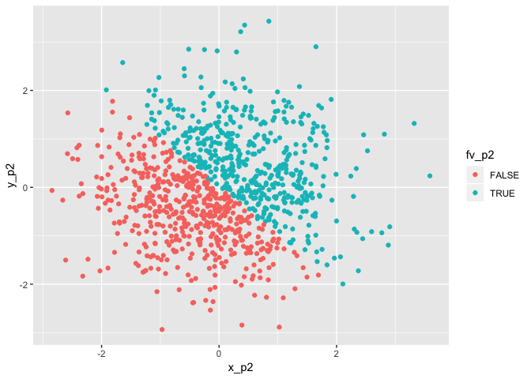

Homework One
================
Xinyi Lin
9/18/2018

Problem 1
---------

### Create data frame

First, I create a data frame comprised of:

-   A random sample of size 10 from a uniform\[0, 5\] distribution

-   A logical vector indicating whether elements of the sample are greater than 2

-   A (length-10) character vector

-   A (length-10) factor vector

``` r
set.seed(13)
rs_p1 = runif(10,0,5)     # create random_sample

lv_p1 = rs_p1 > 2   # create logical vector

cv_p1 = c("A", "N", "A", "P", "P", "L", "E", "A", "N", "D")    # create character vector

fv_p1 = factor(c("A", "N", "A", "P", "P", "L", "E", "A", "N", "D"))      # create factor vector

df_p1 = tibble(rs_p1, lv_p1, cv_p1, fv_p1)   # create data frame

df_p1  # show data frame
```

    ## # A tibble: 10 x 4
    ##     rs_p1 lv_p1 cv_p1 fv_p1
    ##     <dbl> <lgl> <chr> <fct>
    ##  1 3.55   TRUE  A     A    
    ##  2 1.23   FALSE N     N    
    ##  3 1.95   FALSE A     A    
    ##  4 0.457  FALSE P     P    
    ##  5 4.81   TRUE  P     P    
    ##  6 0.0547 FALSE L     L    
    ##  7 2.87   TRUE  E     E    
    ##  8 3.82   TRUE  A     A    
    ##  9 4.37   TRUE  N     N    
    ## 10 0.205  FALSE D     D

The data frame df\_p1 is shown above.

### Calculate the mean

Then, I try to calculate the mean of each variable.

``` r
mean(rs_p1)   #get the mean of rs_p1
```

    ## [1] 2.331807

``` r
mean(lv_p1)   #get the mean of lv_p1
```

    ## [1] 0.5

``` r
mean(cv_p1)   #get the mean of cv_p1
```

    ## Warning in mean.default(cv_p1): argument is not numeric or logical:
    ## returning NA

    ## [1] NA

``` r
mean(fv_p1)   #get the mean of fv_p1
```

    ## Warning in mean.default(fv_p1): argument is not numeric or logical:
    ## returning NA

    ## [1] NA

I found out that only the mean of the random sample and the logical vector can be calculated. As only numbers have a mean, I cannot get the mean of the character vector or the factor vector. Hoever, when I get the mean of the logical vector, as R convert "TRUE" to 1 and "FALSE" to 0, I can get one.

### Convert variables

I try to apply the `as.numeric` function to the logical, character, and factor variables, but only show the chunk without output. So only the R code can be seen. But if I run the R code, I found out that the factor vector and the logical vector can be converted to numeric vectors. Each element in factor vector was converted to the order of that level. While in logical vector, The "TRUE" was converted to 1 and the "FALSE" was converted to 0. The character vector canot be converted to any number, so the result is combination of "NA".

``` r
as.numeric(lv_p1)  

as.numeric(cv_p1)

as.numeric(fv_p1)
```

Then, I try to convert character variable from character to factor to numeric and convert factor variable from factor to character to numeric. I foud out that the character variable was converted to factor and to numeric successfuly, as character can be converted to factor and factor can be converted to numeric. However, character cannot be converted to numeric as shown above. So factor variable was converted to character but fail to convert to numeric.

``` r
cv_p1_fac = as.factor(cv_p1)    # first convert to factor
cv_p1_fac
```

    ##  [1] A N A P P L E A N D
    ## Levels: A D E L N P

``` r
as.numeric(cv_p1_fac)    # then convert to numeric
```

    ##  [1] 1 5 1 6 6 4 3 1 5 2

``` r
fv_p1_cha = as.character(fv_p1)    # first convert to character
fv_p1_cha
```

    ##  [1] "A" "N" "A" "P" "P" "L" "E" "A" "N" "D"

``` r
as.numeric(fv_p1_cha)    # then convert to numeric
```

    ## Warning: NAs introduced by coercion

    ##  [1] NA NA NA NA NA NA NA NA NA NA

Problem 2
---------

### Create data fram

First, I create a data frame comprised of:

-   x: a random sample of size 1000 from a standard Normal distribution

-   y: a random sample of size 1000 from a standard Normal distribution

-   A logical vector indicating whether the x + y &gt; 0

-   A numeric vector created by coercing the above logical vector

-   A factor vector created by coercing the above logical vector

``` r
set.seed(13)

x_p2 = rnorm(1000)       # create x

y_p2 = rnorm(1000)       # create y

lv_p2 = x_p2 + y_p2 > 0   # create logical vector

nv_p2 = as.numeric(lv_p2)     # create numeric vector

fv_p2 = as.factor(lv_p2)    # create factor vector

df_p2 = tibble(x_p2, y_p2, lv_p2, nv_p2, fv_p2)   # create data frame
head(df_p2)      #show first few lines of data frame
```

    ## # A tibble: 6 x 5
    ##     x_p2    y_p2 lv_p2 nv_p2 fv_p2
    ##    <dbl>   <dbl> <lgl> <dbl> <fct>
    ## 1  0.554 -0.587  FALSE     0 FALSE
    ## 2 -0.280  1.12   TRUE      1 TRUE 
    ## 3  1.78   1.25   TRUE      1 TRUE 
    ## 4  0.187 -0.0505 TRUE      1 TRUE 
    ## 5  1.14   0.377  TRUE      1 TRUE 
    ## 6  0.416 -1.22   FALSE     0 FALSE

### Short discription

The observations number of data frame df\_p2 is 1000 and the variables number of data frame df\_p2 is 5.

The mean of x is -0.0031129 and the median of x is -0.0096804.

The proportion of cases for which the logical vector is TRUE is 0.496

### Print scatterplots

Make a scatterplot of y vs x; color points using the logical variable (adding color = ... inside of aes in your ggplot code should help). Make a second and third scatterplot that color points using the numeric and factor variables, respectively, and comment on the color scales.

I make first scatterplot of y vs x which use logical variable to decide color points.

``` r
pic1_p2 = ggplot(df_p2, aes(x = x_p2, y = y_p2, color = lv_p2)) + geom_point()
pic1_p2
```


I make second scatterplot that color points using the numeric variables.

``` r
pic2_p2 = ggplot(df_p2, aes(x = x_p2, y = y_p2, color = nv_p2)) + geom_point()
pic2_p2
```


I make third scatterplot that color points using the factor variables.

``` r
pic3_p2 = ggplot(df_p2, aes(x = x_p2, y = y_p2, color = fv_p2)) + geom_point()
pic3_p2
```



Even though these three pictures look the same except for difference in color, the logic behind then are different. The first and third pictures' color points are decieded by logical and factor vectors, so the color points in these two pictures are seperated into two groups, thus they both show in two different colors. However, second picture's color points use the numeric and factor variables, so they are shown in different color shades which represent different numbers.

At last, I use `ggsave` to export my first scatterplot to my project directory.

``` r
ggsave(filename = "pic1_p2.jpeg", plot = pic1_p2)
```

    ## Saving 7 x 5 in image
