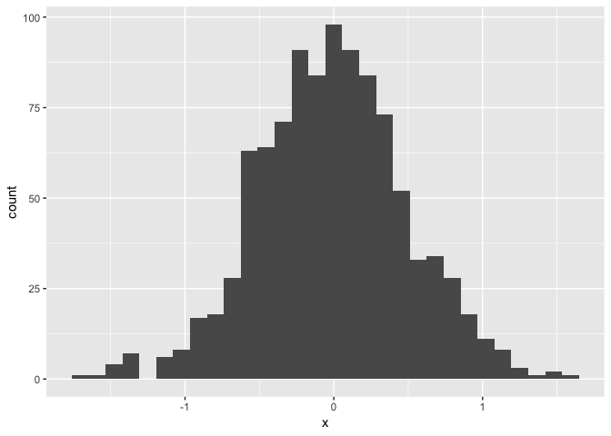
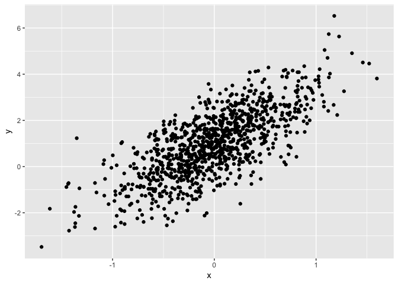

test
================
Xinyi Lin
9/18/2018

The purpose of this file is to present a couple of basic plots using `ggplot`.

First we create a dataframe containing variables for our plots.

``` r
set.seed(1234)

plot_df = tibble(
  x = rnorm(1000, sd = .5),
  y = 1 + 2 * x + rnorm(1000)
)
```

First we show a histogram of the `x` variable.

``` r
ggplot(plot_df, aes(x = x)) + geom_histogram()
```

    ## `stat_bin()` using `bins = 30`. Pick better value with `binwidth`.



Next we show a scatterplot of `y` vs `x`.

``` r
ggplot(plot_df, aes(x = x, y = y)) + geom_point()
```



Headings
--------

1st Level Header
================

2nd Level Header
----------------

### 3rd Level Header

Lists
-----

-   Bulleted list item 1

-   Item 2

    -   Item 2a

    -   Item 2b

1.  Numbered list item 1

2.  Item 2. The numbers are incremented automatically in the output.

Tables
------

| First Header | Second Header |
|--------------|---------------|
| Content Cell | Content Cell  |
| Content Cell | Content Cell  |
